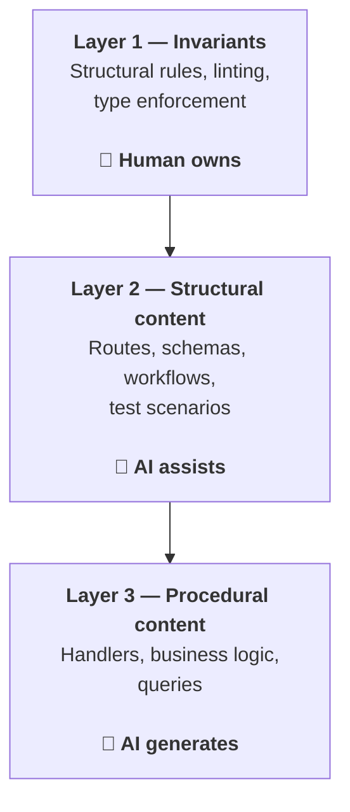

The previous post argued that AI makes building your own project-specific framework cheap, and that rigid, opinionated conventions produce better AI output than generic frameworks.

This post develops the methodology that follows from that: a three-layer architecture for vibe-coded software.

The idea is simple. Any project can be divided into three layers, each with a different relationship to AI generation:

## Layer 1: Invariants and enforcement

The structural rules of your project. A web server has routes. Database access goes through a specific module. UI components come from the design system, not from raw JSX. Environment variables are read in one place. These are the rules that make the project *coherent* — they are not code that implements features, they are code that constrains how feature code is written.

This layer is the hardest to get right and the most exciting to design. It belongs where formal verification, proof-oriented programming, and type-level enforcement may belong in exciting perspectives for code quality. A custom lint rule that forbids `sqlx` calls outside `db/` modules is a small invariant — but it is enforceable at compile time, and it makes the AI more predictable.

**Who owns this:** the engineer. This is hard engineering. The AI does not design your invariants. You do.

## Layer 2: Structural content

The declarative, turing-incomplete description of what your project does. Route definitions — path, accepted content type, URL variables, accepted payload. Database schemas. Workflow models. Test scenarios.

This layer is declarative. It is not code in the full sense — it cannot loop, branch, or produce side effects arbitrarily. It is a specification. And because it is not turing-complete, it is easier to review, verify, and reason about than the code that implements it.

In a vibe coding workflow, this is where the human and the AI collaborate most naturally. The human defines the structure. The AI can help generate it — suggest route shapes, validate schema consistency, propose test scenarios — but the output is reviewable in a way that raw code is not.

**Who owns this:** the architect/designer (which may be the same person as the engineer). The AI assists, but the structure is specified, not generated.

## Layer 3: Procedural content

The code that actually implements the features. Handler functions. Business logic. Data transformations. Queries.

This layer is turing-complete and therefore harder to formally verify. It is also where most of the code lives, and where AI generation adds the most value. The bet of this architecture is that if layers 1 and 2 are strong enough — the invariants are enforced, the structure is declarative and complete — then the AI can produce correct implementations of the procedural content with high reliability.

The linting rules from layer 1 act as a quality harness. The declarative data from layer 2 acts as context. The AI writes the handler. You review the diff.

**Who owns this:** the AI. The human reviews, but the generation is the primary path.

## How this maps to a vibe coding workflow

| Layer | What | How | AI role |
|-------|------|-----|---------|
| Invariants | Structural rules, linting, type enforcement | Hard engineering, formal verification | None (human owns) |
| Structural content | Routes, schemas, workflows, test scenarios | Declarative, turing-incomplete | Assistant (generates suggestions, validates) |
| Procedural content | Handlers, business logic, queries | Turing-complete code | Primary (generates, human reviews) |

The workflow becomes:

1. **Design the invariants.** Write the lint rules, the type constraints, the module boundaries. This is the hardest part and the most important. Get it wrong and the AI will produce wrong code that looks right.
2. **Define the structure.** Specify the routes, the database schema, the workflow scenarios. Keep it declarative. Review it as a specification, not as code.
3. **Let the AI write the handlers.** With the invariants enforced and the structure defined, the remaining code is "just" implementation. The AI has enough context to get it right, and the linting catches what it gets wrong.

## Why this works for vibe coding

Vibe coding gets a bad reputation because it produces code that *works* but is hard to maintain, audit, or extend. The problem is not the generation — it is the lack of structure around the generation.

The three-layer architecture does not reduce the role of AI. It reduces the *surface area* where the AI can make wrong decisions. The invariants are non-negotiable. The structural content is declarative and reviewable. Only the procedural content is free — and by the time you get there, the constraints are tight enough that the AI's output is more likely to be right than wrong.

This is the methodology behind [Backbone](https://blog.without.hosting/posts/backspine-presentation/)'s design. The dylint rules and oxlint plugin enforce the invariants. The proto files, routing declarations, and Gherkin scenarios define the structural content. The AI writes the handler implementations. The architecture is the harness.

[USER: write — a concrete example walking through one feature (e.g. "add a new endpoint") across all three layers. What does the invariant look like? What does the structural content look like? What does the AI generate?]

Referenced from: [Build Your Own Framework (Now That AI Makes It Cheap)](https://blog.without.hosting/posts/ai-libraries-not-frameworks/).